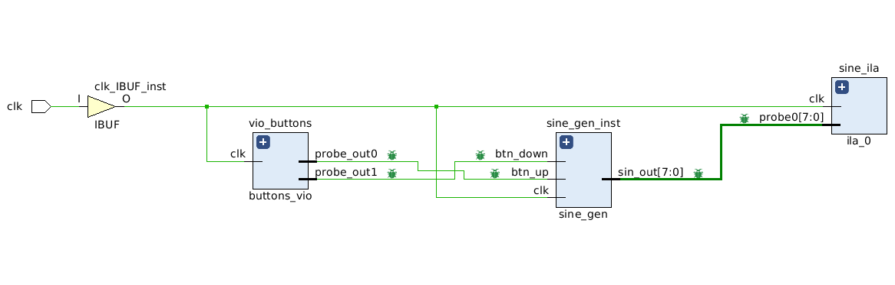
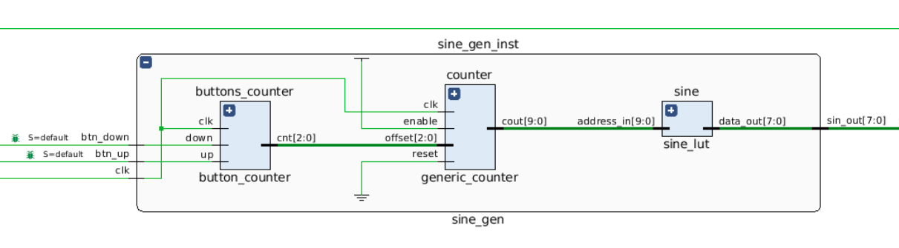
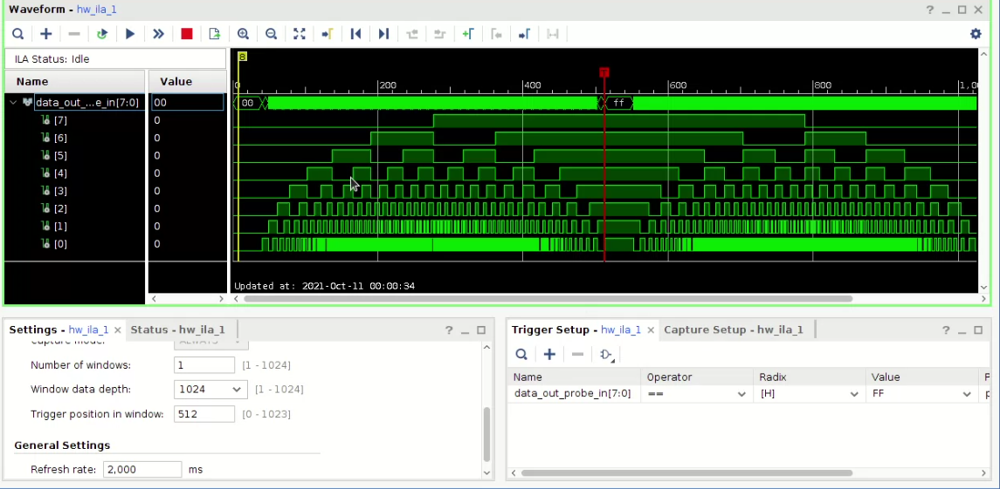
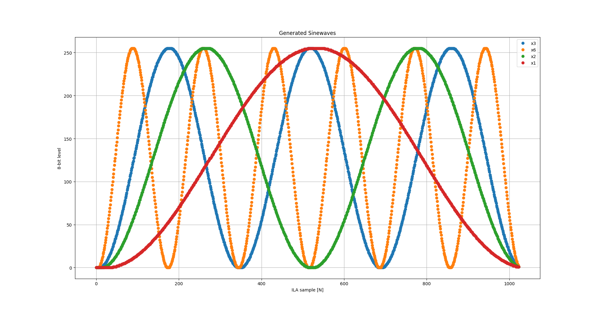

# Circuitos Lógicos Programables: Generador de Señales Senoidales (VHDL)
## Descripción
El programa implementado en VHDL tiene por objeto generar señales senoidales de distintas frecuencias. 
El mismo cuenta con dos entradas que permiten al usuario incrementar/decrementar la frecuencia de salida, ideadas para ser utilizadas con botones físicos, y una única señal de salida, compatible con la entrada de un conversor digital-analógico de 8 bits. Se puede observar a continuación un esquema de alto nivel del sistema.


Puede observarse en el diagrama que hay dos componentes que no intervienen directamente en el funcionamiento del programa/sistema: el bloque _ILA_ y el bloque _VIO_. Su presencia se debe a que el desarrollo del proyecto fue llevado a cabo sin la disponibilidad del hardware en froma física: se utilizó mediante un servidor remoto. Esto no permite utilizar botones, o analizar la señal de salida con un osciloscopio y/o un analizador de señales ordinario, por lo cual, se ha utilizado (1) un bloque de VIO para emular los botones y (2) un ILA propio del hardware que hace las veces de analizador lógico y permite inspeccionar las señales de salida. 

Esto se ve claramente en el esquemático de más alto nivel generado por _Vivado_, presentado a continuación.



## Bloque principal
La arquitectura del bloque principal generador de señales es la siguiente



El bloque principal se descompone en tres sub-bloques:
- ```buttons_counter```: un contador up/down con staturación que cuenta hacia arriba al recibir un flanco ascendente en _up_ y hacia abajo en _down_. Se utiliza para controlar el _offset_ con el que avanza *counter*.
- ```counter```: un contador módulo N que se utiliza para recorrer la memoria que contine las muestras de la senoidal. Se incrementa de a _1 + offset_, permitiendo recorrer la tabla de senoidales a mayor velocidad (salteando muestras) obteniendo así señales de salida d emayor frecuencia.
- ```sine```: una tabla de valores (implementada en forma de ROM) que retorna las muestras de la senoidal.

## Características de Señal de Salida
Para este trabajo se ha elegido que la señal de salida cuente con 256 niveles (8 bits) y tenga 1024 muestras. 

- La cantidad de niveles fue elegida para que la señal sea apta para ser empleada a la entrada de un DAC de 8 bits. 
- La cantidad de muestras fue elegida en base a la cantidad máxima de muestras que puede tomar el _ILA_. De esta forma resulta sencillo evaluar el correcto funcionamiento del programa, ya que al analizar la señal de salida con el analizador lógico integrado, se visualiza exactamente un ciclo completo (o multiplos del mismo) de señal senoidal.

Se muestra a continuación una captura del ILA en Vivado utilizando el hardware remoto.



## Senoidales Generadas
Se muestran 4 senoidales de distintas frecuencias generadas por el programa. En ``x6`` ya se puede apreciar la degradación de la señal, producto del _salteo de muestras_.




