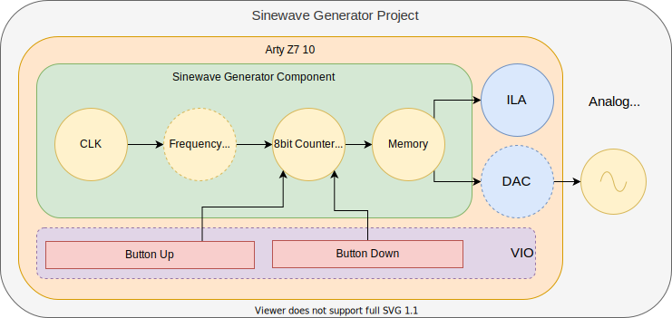

# Circuitos Lógicos Programables: Generador de Señales Senoidales (VHDL)
## Descripción
El programa implementado en VHDL tiene por objeto generar señales senoidales de distintas frecuencias. Cuenta con dos señales de entrada pensadas para ser utilizadas con botones físicos, que permiten al usuario incrementar/decrementar la frecuencia de salida de la señal. La señal de salida, por su parte, está pensada para ser mapeada a un conversor digital a analógico de 8 bits. Se puede observar a continuación un esquema de alto nivel del sistema.



Pueden observarse en el diagrama dos componentes que no intervienen en el funcionamiento del programa/sistema: el bloque _ILA_ y el bloque _VIO_. Su presencia se debe a que el desarrollo del proyecto fue llevado a cabo sin la disponibilidad del hardware involucrado de froma física, sino mediante un servidor remoto. Esto no permite utilizar botones o analizar la señal de salida con un osciloscopio o un analizador de señales físico, por lo cual, se ha utilizado (1) un bloque de VIO para emular los botones y (2) el ILA propio del hardware que hace las veces de analizador lógico y permite analizar las señales de salida. 

A continuación se presenta una tabla con las entradas/salidas del sistema y sus adaptaciones correspondientes dadas las condiciones de desarrollo.

|           | Selector de Frecuencias (Entrada) | Señal Senoidal (Salida) |
|-----------|-----------------------------------|-------------------------|
| Ideal     | Switches                          | DAC + Osciloscopio      |
| Reemplazo | VIO                               | ILA                     |

## Esquemático de Alto Nivel
<embed src="./doc/Schematic (Detailed).pdf" width="500" height="375" 
 type="application/pdf">


## Bloques Funcionales

### Tabla/Memoria de Señal
Este bloque mapea valores de un contador con los valores que conforman la señal de salida. Es simplemente una memoria ROM y opera de forma asincrónica

La tabla de valores se genera mediante un script incluído en este repositorio, que permite ajustar las carácterísticas de la senoidal que se desea generar. Además, permite conocer si es posible implementar una tabla con las condiciones dadas. A continuación se muestra un ejemplo del resultado de la ejecución del script.


#### Invocación
```bash
python3 tools/sine_table_gen.py 
```
#### Salida
```vhdl
--- Sinewave Specs ---
-- Clock Frequency (HZ):                50000000.0
-- Sinewave Frequency (HZ):             100
-- Sine Number of Samples:              256
-- Sinewave Number of Bits:             8
-- Table Clock Freq (HZ):               25600
-- PWM Clock Frequency (HZ):            6553600
-- FPGA Clock Required Divider:         7.62939453125
-- Sine HZ with Int Divider (7):        108
-- Feasible:                            YES
--- 

    case address is
        when "00000000" => result <= "01111111"; -- 0x7f
        when "00000001" => result <= "10000011"; -- 0x83
        ...
        when "11111110" => result <= "01111100"; -- 0x7c
        when "11111111" => result <= "01111111"; -- 0x7f
    end case;
```
