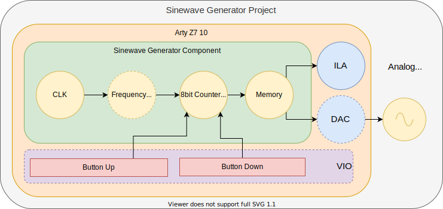

# Circuitos Lógicos Programables: Generador de Señales Senoidales (VHDL)
## Descripción
El programa implementado en VHDL tiene por objeto generar señales senoidales de distintas frecuencias. Cuenta con dos señales de entrada pensadas para ser utilizadas con botones físicos, que permiten al usuario incrementar/decrementar la frecuencia de salida de la señal. La señal de salida, por su parte, está pensada para ser mapeada a un conversor digital a analógico de 8 bits. Se puede observar a continuación un esquema de alto nivel del sistema.

Pueden observarse en el diagrama dos componentes que no intervienen en el funcionamiento del programa/sistema: el bloque _ILA_ y el bloque _VIO_. Su presencia se debe a que el desarrollo del proyecto fue llevado a cabo sin la disponibilidad del hardware involucrado de froma física, sino mediante un servidor remoto. Esto no permite utilizar botones o analizar la señal de salida con un osciloscopio o un analizador de señales físico, por lo cual, se ha utilizado (1) un bloque de VIO para emular los botones y (2) el ILA propio del hardware que hace las veces de analizador lógico y permite analizar las señales de salida. 

A continuación se presenta una tabla con las entradas/salidas del sistema y sus adaptaciones correspondientes dadas las condiciones de desarrollo.

|           | Selector de Frecuencias (Entrada) | Señal Senoidal (Salida) |
|-----------|-----------------------------------|-------------------------|
| Ideal     | Switches                          | DAC + Osciloscopio      |
| Reemplazo | VIO                               | ILA                     |

## Detalles Técnicos de la Señal de Salida
A continuación se presenta una tabla con las carácterísticas de la señal de salida del programa implementado. Cabe destacar que el programa permite modificar estos valores sin grandes modificaciones del código fuente.

|       | Nro. de Niveles | Nro. de Frecuencias | Nro. de Muestras  p/ Freq. Mín. | Nro. de Muestras  p/ Freq. Max. | Freq. Mín. [KHz] | Freq. Máx. [KHz] |
|-------|-----------------|---------------------|---------------------------------|---------------------------------|------------------|------------------|
| Señal | 256 (8 bits)    | 8                   | 5000                             | 625                              | 10              | 80             |

